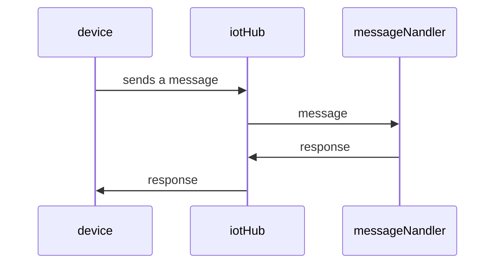

# ResxManager
````

```mermaid
sequenceDiagram
    participant device
    participant iotHub
    participant messageNandler
    device->>iotHub: sends a message
    iotHub->>messageNandler: message
    messageNandler->>iotHub: response
    iotHub->>device: response
```
````


```mermaid
sequenceDiagram
    participant device
    participant iotHub
    participant messageNandler
    device->>iotHub: sends a message
    iotHub->>messageNandler: message
    messageNandler->>iotHub: response
    iotHub->>device: response
```
